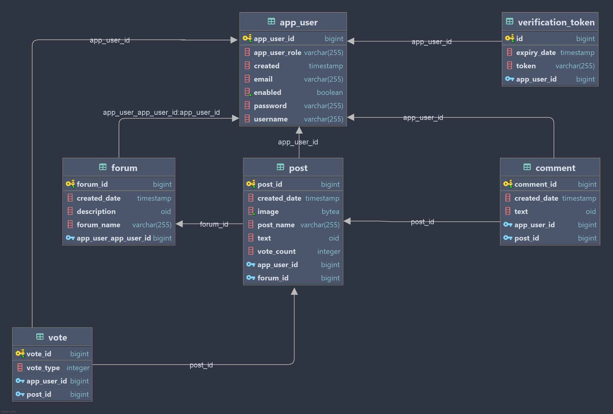

# Sociorama API

Sociorama is a blog/social sharing site where you can post to a forum and other users can share their thoughts via comments or likes.  

> Java Spring-MVC Spring-Boot Spring-Security Tomcat PostgreSQL JPA Hibernate JUnit

The backend application was built on Java, Spring Boot and Spring MVC. The database's entities include User, Forum, Post, and Comment. The GET endpoints to access these entities are public, but the POST, PUT, and DELETE endpoints are protected using Spring Security.

Here is source code for the [frontend application](https://github.com/badass-techie/Sociorama), and a [live demo]().

## Database Schema

## Features

- Create a user account
- Activate your account via email
- Change your password or delete your account
- Create (POST) a forum, post, comment
- Like a post
- View (GET) all posts, posts in a forum, posts by user
- View (GET) all forums
- View (GET) all comments on a post, comments by user
- Edit (PUT) and delete (DELETE) your posts, comments, and forums
